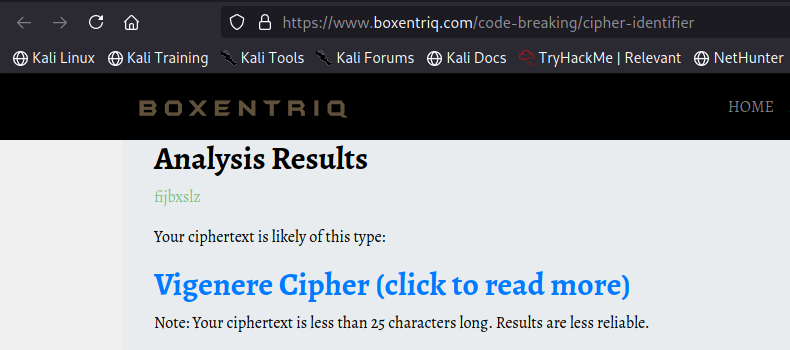
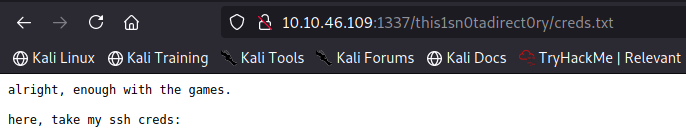
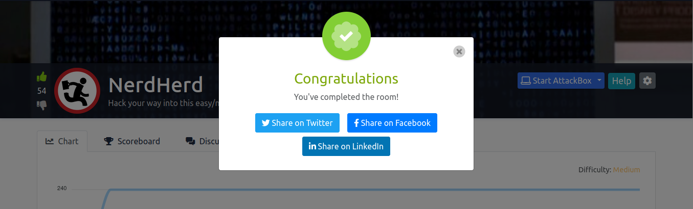

# NerdHerd

* This is a write up of the room ["NerdHerd"](https://tryhackme.com/room/nerdherd) created by 0xpr0N3rd at TryHackMe.

* I completed this room using Parrot OS so there might be a syntax difference if you use another Linux distribution.

* This challenge is marked as MEDIUM difficulty but I believe hackers of all levels can complete it and learn a lot from it!

                ** HAVE FUN!! 
                
                            

* First we start with some basic enumeration with nmap.

* We see ports 21 (FTP), 22 (SSH) and 139 (SMB) open, and the latest allows us to login anonymously, so that will be 
our next step.

* We see a couple of files, download them into our machine...

........and examine their contents.

* Everything we need is on the leet. That's a funny hint we will use in a bit! Next we will examine the image file.

* Nothing to help us, so let's examine it further using exiftool

* Looking at all the output, something caught my attention... what is `fijbxslz` ??

.............

ANYWAYS...let's go see what's in the leet!

* Hahaha some XSS going on here! Very, very nice!! Clicking on it...

* Besides the Apache homepage, we can't really see anything helpful, so let's go peek at the source!!

* Roger that!! We will keep digging (so nice of you to let us know we're in the right track!!)

* We reached the end of the page...and something unusual is right there! A Youtube link!

* Next, while we enjoy this oldie, let's hunt for possible hidden directories with gobuster!

* We access the found directory, see a login page which is not helpful at all since we dont have any credentials!!

....................

OK... not seeing anything else that might help us, we can just run a tool like `enum4linux' to see if anything worth checking comes!

* NICE!! We found Chuck as user and we also found a classified share! But no password (yet). Let's think about it. What else 
do we have so far that we haven't been able to use (yet)?? That gibberish that was inside the image file!! 

    ** little tip here: when you see this kind of gibberish and you suspect it might be something helpful, go to 
    https://brokentriq.com , insert it there and see if something insightful comes up!!
    

* So it wasn't useless gibberish after all! Next, we go to Cyber Chef (awesome, handy tool!!)

........... AND we're stuck again!! Where is the key for this?? 

* Putting our thinking cap again. What else we have that we haven't been able to use (yet)? Oh yeah, the oldie tune! 
(I went to the Youtube video... watched it instead of listening only while doing gobuster, but nothing visually helpful either. Lyrics? We need a key... key=word=song lyrics?? Go google the lyrics for this song and have fun trying them on Cyber Chef :)) )

* Finally!! Now we have the user, we have what seems like a password... let's try to peek at that classified share!!

* YAY!! We can finally SSH into Chuck's account!!

.......... and we have our user.txt!! Next, we need to do some privesc to get ahold of root.txt.

Here, I went on a manual enumeration loooooong hunt and nothing seemed to work (save you the work of uploading linpeas and not really finding anything.) 

From now on, I will show what I ended up doing to pwn this machine.

* KERNEL EXPLOIT!! 

    * go to https://www.exploit-db.com/exploits/45010
    * save the exploit in your machine and upload it in Chuck's machine ( I like the python server/wget method)
    * compile it
    * make it executable
    * run exploit
    

........ PWNED!! :)

But we're not done since we need to find the bonus flag...
NO clue where it is, so no shame on looking at the hint!!

* It's a great hint!! History ... the first thing that comes to mind is ...

(Stabilized the shell at this point, since I thought I would be spending a long time in it)

Keep scrolling down and you will find what you're looking for!!!

I hope you enjoyed this super fun, challenging room and thank you so much for reading my writeup!!

Happy Hacking!!

                   `Crypto Tzipi aka CyberLola`

